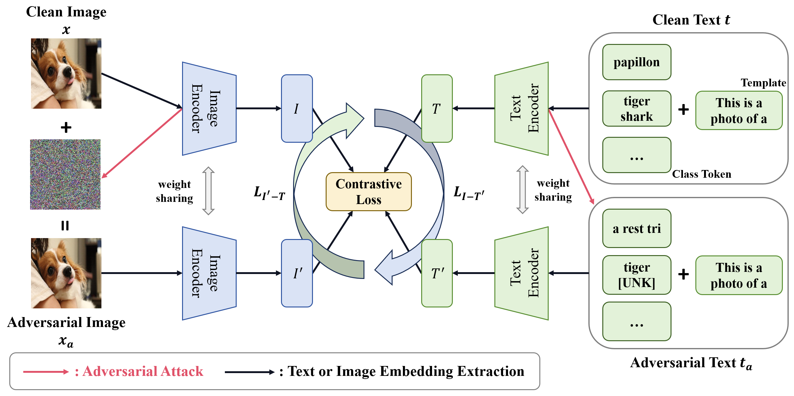

# Revisiting the Adversarial Robustness of Vision Language Models: a Multimodal Perspective
Official implementation of the paper "[Revisiting the Adversarial Robustness of Vision Language Models: a Multimodal Perspective](https://arxiv.org/pdf/2404.19287)"


## Highlights
<div align="center">
  
</div>

> **Abstract:** *Pretrained vision-language models (VLMs) like CLIP have shown impressive generalization performance across various downstream tasks, yet they remain vulnerable to adversarial attacks. While prior research has primarily concentrated on improving the adversarial robustness of image encoders to guard against attacks on images, the exploration of text-based and multimodal attacks has largely been overlooked. In this work, we initiate the first known and comprehensive effort to study adapting vision-language models for adversarial robustness under the multimodal attack. Firstly, we introduce a multimodal attack strategy and investigate the impact of different attacks. We then propose a multimodal contrastive adversarial training loss, aligning the clean and adversarial text embeddings with the adversarial and clean visual features, to enhance the adversarial robustness of both image and text encoders of CLIP. Extensive experiments on 15 datasets across two tasks demonstrate that our method significantly improves the adversarial robustness of CLIP. Interestingly, we find that the model fine-tuned against multimodal adversarial attacks exhibits greater robustness than its counterpart fine-tuned solely against image-based attacks, even in the context of image attacks, which may open up new possibilities for enhancing the security of VLMs.*

<details>

<summary>Main Contributions</summary>

- To the best of our knowledge, we initiate the first known and comprehensive effort to study adapting VLMs for adversarial robustness under the multimodal attack.
- We propose a simple yet effective **M**ulti**m**odal **Co**ntrastive **A**dversarial training loss, which can effectively enhance the adversarial robustness of both image and text encoders.
- Extensive experiments on 15 datasets for two tasks demonstrate that our method can significantly enhance the adversarial robustness of CLIP. Meanwhile, our detailed analyses can offer valuable insights to enhance the security of VLMs.

</details>


## Running Code
Follow the instructions below to set up the environment and run the code.

### Conda Environment
```bash
conda create -n clip python==3.8

conda install pytorch==1.12.1 torchvision==0.13.1 torchaudio==0.12.1 cudatoolkit=11.3 -c pytorch

pip install transformers==4.8.1 timm==0.4.9 bert_score==0.3.11 chardet ftfy==6.1.1 ruamel_yaml==0.15.80 opencv-python

bash models/download_models.sh
```

### Replacement

Please replace the existing repositories, including the torchvision dataset and CLIP model, with the Python files located in the 'replace' directory.
Deatails can be seen in https://github.com/cvlab-columbia/ZSRobust4FoundationModel.git

Note that, please use this 'replace' directory.

### MMCoA Usage Instructions

To run the MMCoA script with specific configurations, use the following command:

```bash
python MMCoA.py --config=[config path] \
                --attack_domain=both1 \
                --dataset=cifar100 \
                --seed=42
```

### Testing Instructions

For testing, execute the following command, ensuring you specify the path to your test configuration and checkpoint directory:

```bash
python test.py --config=[your test yaml path] \
               --attack_domain=all \
               --dataset=[your test dataset] \  ###e.g., cifar100
               --resume_test \
               --ckpt_dir=[checkpoint path]
```

Ensure to replace placeholder paths (e.g., `[config path]`, `[your test yaml path]`, and `[checkpoint path]`) with the actual file paths before running the commands. 


## Citation
If you find this code useful in your research, please consider citing our paper:
```bibtex
@misc{zhou2024revisiting,
      title={Revisiting the Adversarial Robustness of Vision Language Models: a Multimodal Perspective}, 
      author={Wanqi Zhou and Shuanghao Bai and Qibin Zhao and Badong Chen},
      year={2024},
      eprint={2404.19287},
      archivePrefix={arXiv},
      primaryClass={cs.CV}
}
```


## Contact

If you have any questions or feedback, please create an issue on this repository or feel free to contact us at Zhouwanqistu@163.com or baishuanghao@stu.xjtu.edu.cn.


## Acknowledgements

This implementation is based on [ZSRobust4FoundationModel](https://github.com/cvlab-columbia/ZSRobust4FoundationModel.git).

