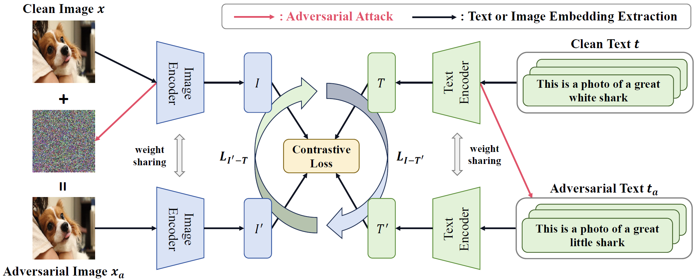

# Revisiting the Adversarial Robustness of Vision Language Models: a Multimodal Perspective
Official implementation of the paper "[Revisiting the Adversarial Robustness of Vision Language Models: a Multimodal Perspective](https://arxiv.org/pdf/2404.19287)"


## Highlights
<div align="center">
  
</div>

> **Abstract:** *Pretrained vision-language models (VLMs) like CLIP exhibit exceptional generalization across diverse downstream tasks. While recent studies reveal their vulnerability to adversarial attacks, research to date has primarily focused on enhancing the robustness of image encoders against image-based attacks, with defenses against text-based and multimodal attacks remaining largely unexplored. To this end, this work presents the first comprehensive study on improving the adversarial robustness of VLMs against attacks targeting image, text, and multimodal inputs. This is achieved by proposing multimodal contrastive adversarial training (MMCoA). Such an approach strengthens the robustness of both image and text encoders by aligning the clean text embeddings with adversarial image embeddings, and adversarial text embeddings with clean image embeddings. The robustness of the proposed MMCoA is examined against existing defense methods over image, text, and multimodal attacks on the CLIP model. Extensive experiments on 15 datasets across two tasks reveal the characteristics of different adversarial defense methods under distinct distribution shifts and dataset complexities across the three attack types.  This paves the way for a unified framework of adversarial robustness against different modality attacks, opening up new possibilities for securing VLMs against multimodal attacks.*

<details>

<summary>Main Contributions</summary>

- To the best of our knowledge, we conduct the first comprehensive study aimed at enhancing the adversarial robustness of VLMs against attacks targeting visual, textual, and multimodal inputs.
- We propose the Multimodal Contrastive Adversarial training (MMCoA), which effectively enhances the adversarial robustness of both image and text encoders.
- Extensive experiments and detailed analysis on 15 datasets for two tasks under three types of attacks reveal the performance and characteristics of different adversarial defense methods, providing valuable insights for enhancing the security of VLMs.

</details>


## Running Code
Follow the instructions below to set up the environment and run the code.

### Conda Environment
```bash
conda create -n clip python==3.8

conda install pytorch==1.12.1 torchvision==0.13.1 torchaudio==0.12.1 cudatoolkit=11.3 -c pytorch

pip install transformers==4.8.1 timm==0.4.9 bert_score==0.3.11 chardet ftfy==6.1.1 ruamel_yaml==0.15.80 opencv-python

bash models/download_models.sh
```

### Replacement

Please replace the existing repositories, including the torchvision dataset and CLIP model, with the Python files located in the 'replace' directory.
Deatails can be seen in https://github.com/cvlab-columbia/ZSRobust4FoundationModel.git

Note that, please use this 'replace' directory.

### MMCoA Usage Instructions

To run the MMCoA script with specific configurations, use the following command:

```bash
python MMCoA.py --config=[config path] \
                --attack_domain=both1 \
                --dataset=cifar100 \
                --seed=42
```

### Testing Instructions

For testing, execute the following command, ensuring you specify the path to your test configuration and checkpoint directory:

```bash
python test.py --config=[your test yaml path] \
               --attack_domain=all \
               --dataset=[your test dataset] \  ###e.g., cifar100
               --resume_test \
               --ckpt_dir=[checkpoint path]
```

Ensure to replace placeholder paths (e.g., `[config path]`, `[your test yaml path]`, and `[checkpoint path]`) with the actual file paths before running the commands. 


## Citation
If you find this code useful in your research, please consider citing our paper:
```bibtex
@misc{zhou2024revisiting,
      title={Revisiting the Adversarial Robustness of Vision Language Models: a Multimodal Perspective}, 
      author={Wanqi Zhou and Shuanghao Bai and Qibin Zhao and Badong Chen},
      year={2024},
      eprint={2404.19287},
      archivePrefix={arXiv},
      primaryClass={cs.CV}
}
```


## Contact

If you have any questions or feedback, please create an issue on this repository or feel free to contact us at Zhouwanqistu@163.com.


## Acknowledgements

This implementation is based on [ZSRobust4FoundationModel](https://github.com/cvlab-columbia/ZSRobust4FoundationModel.git).

